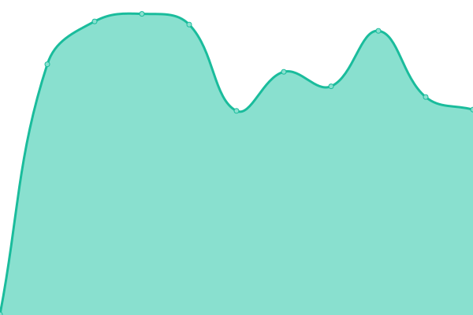
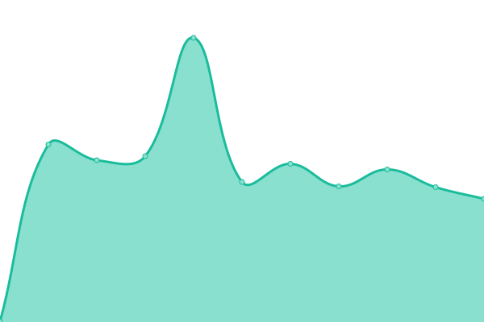

# [📈 实时状态](https://demo.upptime.js.org): <！ -实时状态- > **所有系统都可以正常运行**

This repository contains the open-source uptime monitor and status page for [xingkong](https://blog.imydd.top), powered by [Upptime](https://github.com/upptime/upptime).

With [Upptime](https://upptime.js.org), you can get your own unlimited and free uptime monitor and status page, powered entirely by a GitHub repository. We use [Issues](https://github.com/dpy013/upptime/issues) as incident reports, [Actions](https://github.com/dpy013/upptime/actions) as uptime monitors, and [Pages](https://demo.upptime.js.org) for the status page.

## [📈 Live Status](https://demo.upptime.js.org): <!--live status--> **所有系统都可以正常运行**

<!--start: status pages-->
<!-- This summary is generated by Upptime (https://github.com/upptime/upptime) -->
<!-- Do not edit this manually, your changes will be overwritten -->
<!-- prettier-ignore -->
| 链接 | 状态 | 历史 | 响应时间 | 正常运行时间 |
| --- | ------ | ------- | ------------- | ------ |
|  [NV Access](https://www.nvaccess.org) | 🟩 正常运行 | [nv-access.yml](https://github.com/dpy013/upptime/commits/HEAD/history/nv-access.yml) | 

 1995毫秒
     
 | 

<a href="https://dpyblog.cn/history/nv-access">100.00%</a>
    

|  [NV Access CI](https://ci.appveyor.com/project/nvaccess/nvda) | 🟩 正常运行 | [nv-access-ci.yml](https://github.com/dpy013/upptime/commits/HEAD/history/nv-access-ci.yml) | 

 262毫秒
     
 | 

<a href="https://dpyblog.cn/history/nv-access-ci">100.00%</a>
    

|  [NV Access GitHub](https://github.com/nvaccess) | 🟩 正常运行 | [nv-access-git-hub.yml](https://github.com/dpy013/upptime/commits/HEAD/history/nv-access-git-hub.yml) | 

 425毫秒
     
 | 

<a href="https://dpyblog.cn/history/nv-access-git-hub">100.00%</a>
    

|  [NV Access NVDA](https://github.com/nvaccess/nvda) | 🟩 正常运行 | [nv-access-nvda.yml](https://github.com/dpy013/upptime/commits/HEAD/history/nv-access-nvda.yml) | 

 414毫秒
     
 | 

<a href="https://dpyblog.cn/history/nv-access-nvda">100.00%</a>
    

<!--end: status pages-->

[**Visit our status website →**](https://demo.upptime.js.org)

## 📄 License

- Powered by: [Upptime](https://github.com/upptime/upptime)
- Code: [MIT](./LICENSE) © [Anand Chowdhary](https://anandchowdhary.com), supported by [Pabio](https://pabio.com)
- Data in the `./history` directory: [Open Database License](https://opendatacommons.org/licenses/odbl/1-0/)
